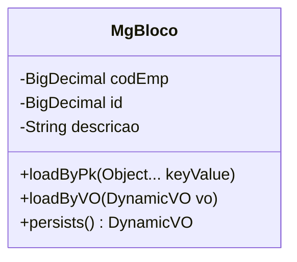

# Bloco

## Detalhamento da Entidade

O Bloco é a principal matéria-prima do setor. É em formato de cubo, extraído da rocha por explosão x corte, através de uma unidade maior denominada “Prancha”. É controlado no estoque por metro cúbico. A partir de um Bloco são geradas as chapas brutas.

### Objetos Relacionados

| Nome | Tipo do Objeto | Descrição |
|--|--|--|
| [TMGBLOCO](TMGBLOCO.md) | Tabela | [MG] Bloco |

### Modelagem

### Histórico de Revisões

| Versão | Data | Autor | Observações |
|:--:|:--:|--|--|
| 1.0 | 21/11/2025 | Cassio Menezes | Criação do documento |
