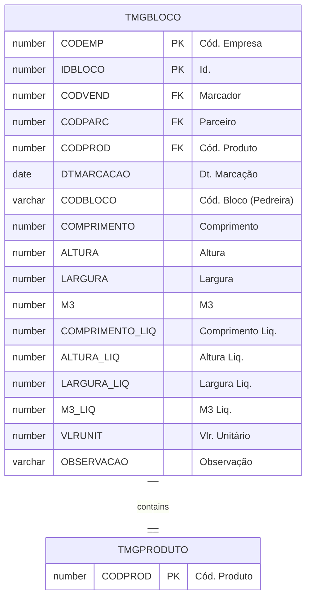
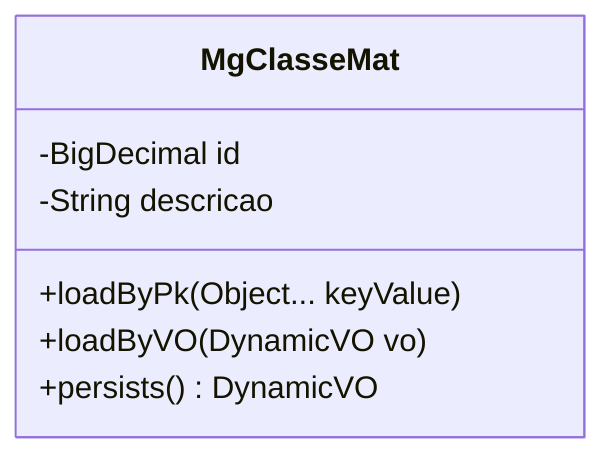

# TMGBLOCO

## Detalhamento do Objeto

O Bloco é a principal matéria-prima do setor. Em formato de cubo, é extraído da rocha por explosão x corte, a partir de uma unidade maior denominada “Prancha”. A unidade de medida é o metro cúbico, utilizado para controlar o estoque. A partir de um Bloco são geradas as chapas brutas.

O Marcador compra o Bloco diretamente na pedreira, anotando as medidas (bruta e líquida) do material, valor unitário de compra, valor do frete, classificação e observações. Cada bloco tem um número de pedreira próprio.

### Objetos Relacionados

| Nome | Tipo do Objeto | Descrição |
|--|--|--|
| [TMGPRODUTO](TMGPRODUTO.md) | Tabela | [MG] Produto |

### Modelagem

### Histórico de Revisões

| Versão | Data | Autor | Observações |
|:--:|:--:|--|--|
| 1.0 | 26/11/2025 | Cassio Menezes | Criação do documento |
