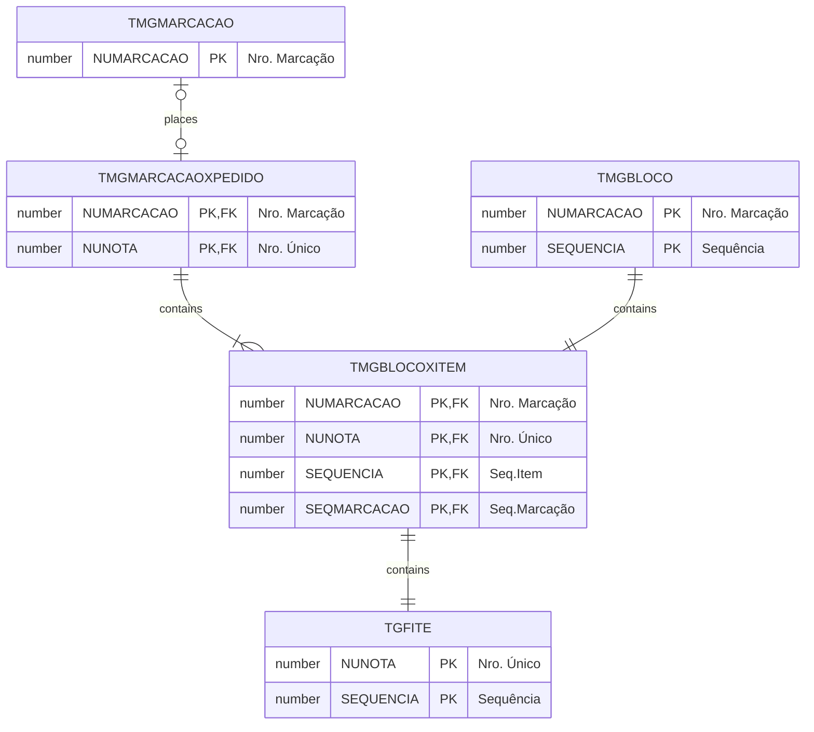

# TMGBLOCOXITEM

**Nome tabela**: TMGBLOCOXITEM  
**Descrição**: [MG] Bloco x Item  
**Nome instância**: MgBlocoXItem

## Detalhamento do Objeto

### Modelagem

### Histórico de Revisões

| Versão | Data | Autor | Observações |
|:--:|:--:|--|--|
| 1.0 | 27/12/2025 | Cassio Menezes | Criação do documento |