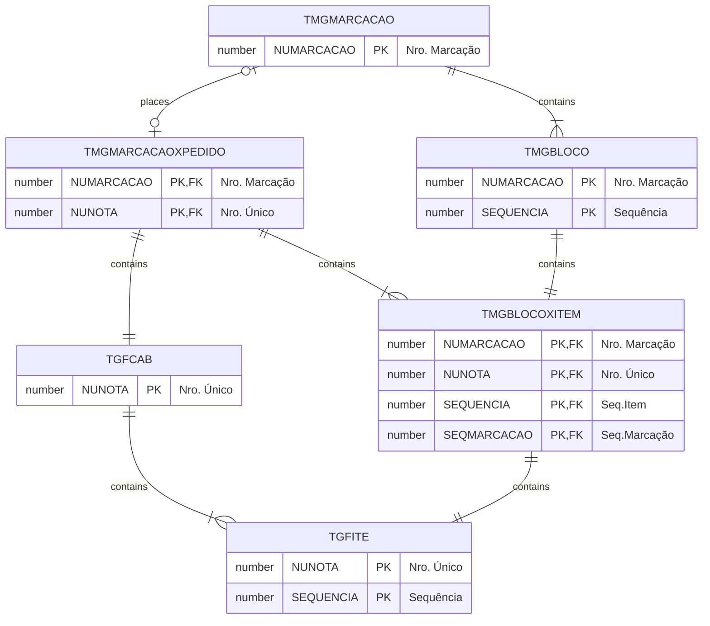

# TMGBLOCOXITEM

## Detalhamento do Objeto

Ligação entre um Bloco e o Item do Pedido de Compra de Marcação respectivo.

| Evento | Valor |
|--|--|
| **Nome tabela** | TMGBLOCOXITEM |
| **Descrição** | [MG] Bloco x Item |
| **Nome instância** | MgBlocoXItem |
| **Descrição instância** | Item do Pedido de Compra |

### Objetos Relacionados

| Nome | Tipo do Objeto | Descrição |
|--|--|--|
| [TMGBLOCO](TMGBLOCO.md) | Tabela | MgBloco |
| [TMGMARCACAO](TMGMARCACAO.md) | Tabela | MgMarcacao |
| [TMGMARCACAOXPEDIDO](TMGMARCACAOXPEDIDO.md) | Tabela | MgMarcacaoXPedido |

### Modelagem

### Histórico de Revisões

| Versão | Data | Autor | Observações |
|:--:|:--:|--|--|
| 1.2 | 03/01/2025 | Cassio Menezes | Nova estrutura |
| 1.0 | 27/12/2024 | Cassio Menezes | Criação do documento |