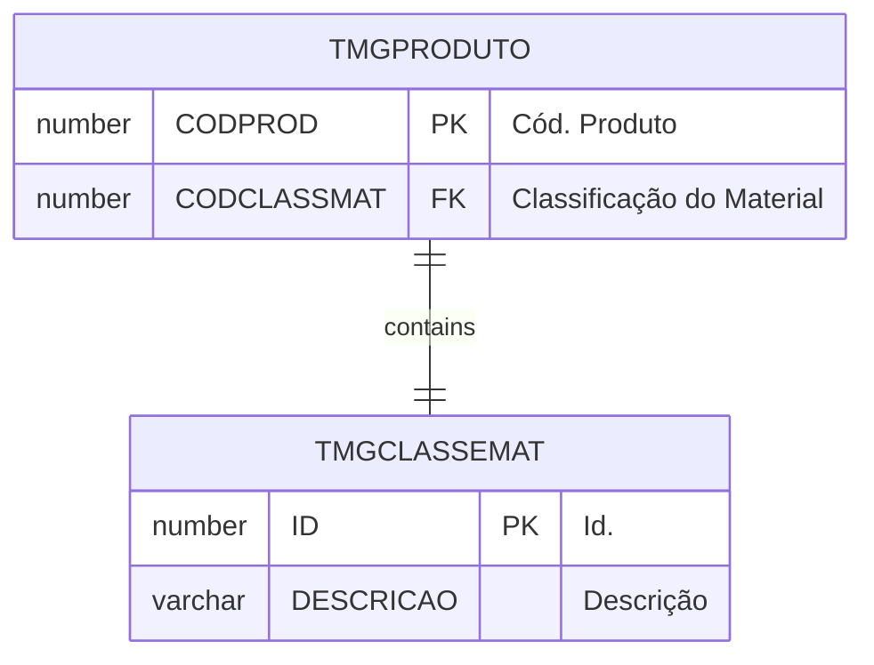

# TMGCLASSEMAT

## Detalhamento do Objeto

Códigos de classes de materiais.

| Evento | Valor |
|--|--|
| **Nome tabela** | TMGCLASSEMAT |
| **Descrição** | [MG] Classe de Material |
| **Nome instância** | MgClasseMaterial |
| **Descrição instância** | Códigos de classes de materiais |
| **Lançador** |
| Descrição do Controle | [MG] Classe de Material |
| Identificador | br.com.sankhya.pwn.margran.ClasseMaterial |
| Evento | ${dynaform:MgClasseMaterial} |
| contexto | pwnmargran |
| entityName | MgClasseMaterial |
| resourceID | br.com.pwn.margran.core.mgclassematerial |

### Objetos Relacionados

| Nome | Tipo do Objeto | Descrição |
|--|--|--|
| [TMGPRODUTO](TMGPRODUTO.md) | Tabela | [MG] Produto |

### Modelagem

### Histórico de Revisões

| Versão | Data | Autor | Observações |
|:--:|:--:|--|--|
| 1.2 | 03/01/2025 | Cassio Menezes | Nova estrutura |
| 1.1 | 19/11/2024 | Cassio Menezes | Ajuste nomenclatura |
| 1.0 | 12/11/2024 | Cassio Menezes | Criação do documento |
