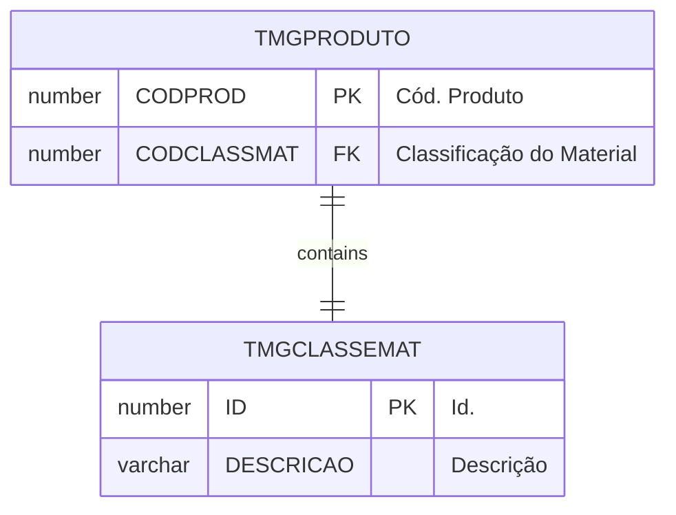
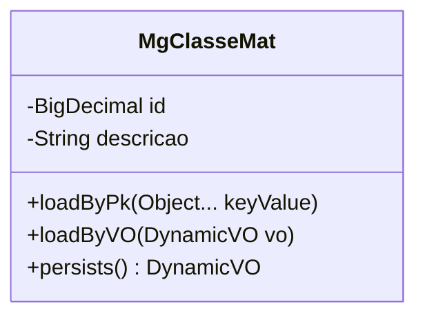

# TMGCLASSEMAT

## Detalhamento do Objeto

  Códigos de classes de materiais.

### Objetos Relacionados

| Nome | Tipo do Objeto | Descrição |
|--|--|--|
| TMGPRODUTO | Tabela | [MG] Produto |

### Modelagem

### Histórico de Revisões

| Versão | Data | Autor | Observações |
|:--:|:--:|--|--|
| 1.1 | 19/11/2025 | Cassio Menezes | Ajuste nomenclatura |
| 1.0 | 12/11/2025 | Cassio Menezes | Criação do documento |
