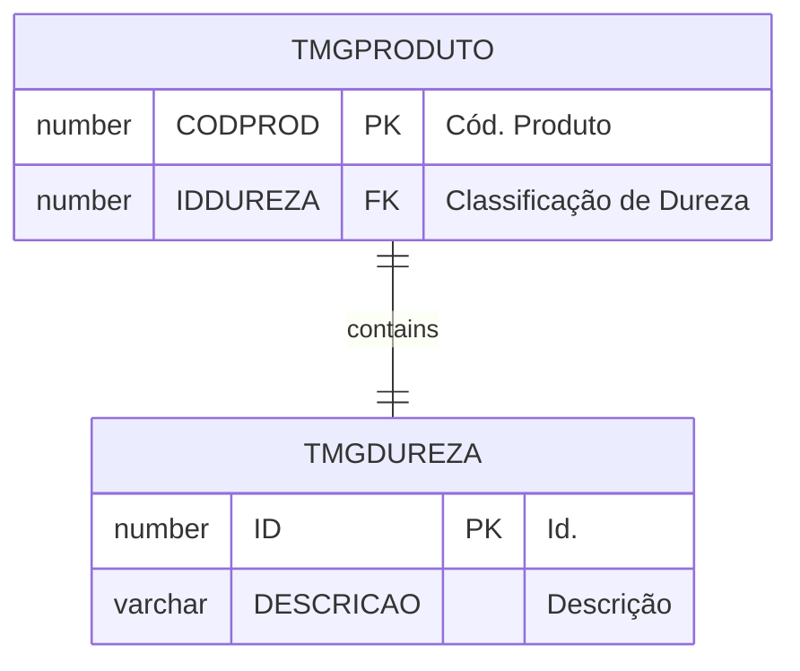

# TMGDUREZA

## Detalhamento do Objeto

Códigos de classificação de dureza de minerais.

| Evento | Valor |
|--|--|
| **Nome tabela** | TMGDUREZA |
| **Descrição** | [MG] Classificação de Dureza |
| **Nome instância** | MgDureza |
| **Descrição instância** | Classificação de Dureza de Minerais |
| **Lançador** |
| Descrição do Controle | [MG] Classificação de Dureza |
| Identificador | br.com.sankhya.pwn.margran.ClassificacaoDureza |
| Evento | ${dynaform:MgDureza} |
| contexto | pwnmargran |
| entityName | MgDureza |
| resourceID | br.com.pwn.margran.core.mgdureza |

### Objetos Relacionados

| Nome | Tipo do Objeto | Descrição |
|--|--|--|
| [TMGPRODUTO](TMGPRODUTO.md) | Tabela | [MG] Produto |

### Modelagem

### Histórico de Revisões

| Versão | Data | Autor | Observações |
|:--:|:--:|--|--|
| 1.2 | 03/01/2025 | Cassio Menezes | Nova estrutura |
| 1.1 | 19/11/2024 | Cassio Menezes | DD |
| 1.0 | 12/11/2024 | Cassio Menezes | Criação do documento |
