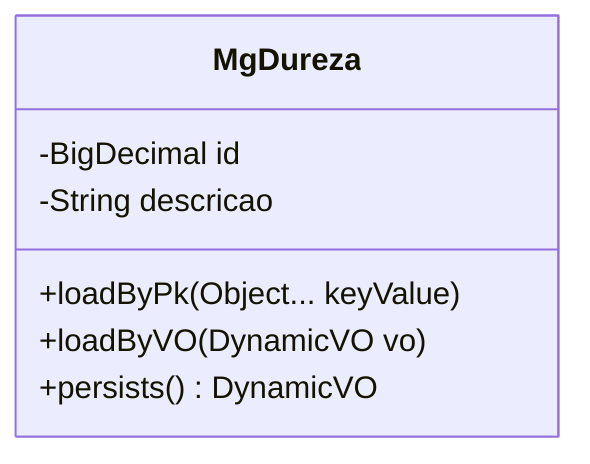

# TMGDUREZA

## Detalhamento do Objeto

  Códigos de classificação de dureza de minerais.

### Objetos Relacionados

| Nome | Tipo do Objeto | Descrição |
|--|--|--|
| TMGPRODUTO | Tabela | [MG] Produto |

### Modelagem

### Histórico de Revisões

| Versão | Data | Autor | Observações |
|:--:|:--:|--|--|
| 1.0 | 12/11/2025 | Cassio Menezes | Criação do documento |
