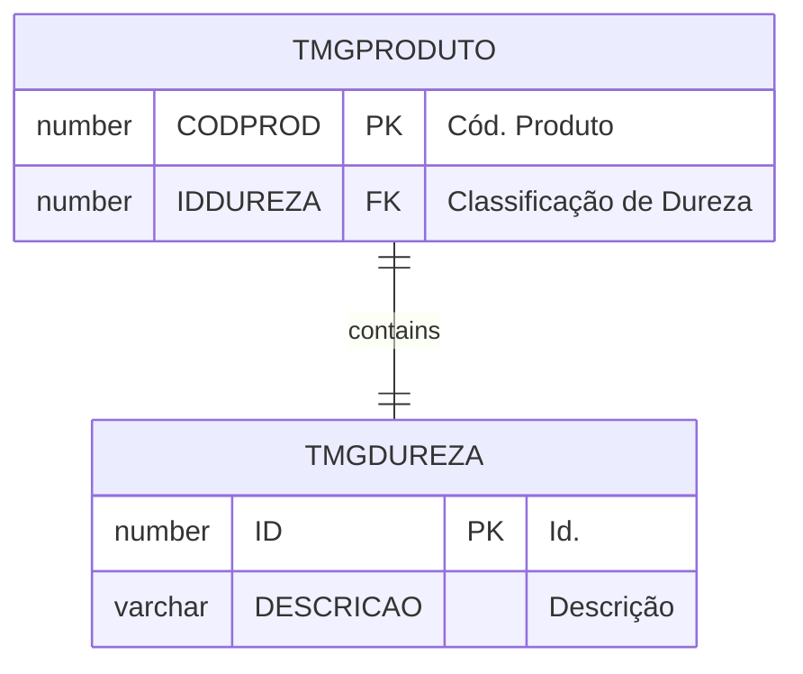
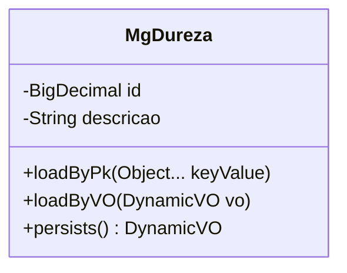

# TMGDUREZA

## Detalhamento do Objeto

  Códigos de classificação de dureza de minerais.

### Dicionário de Dados

#### Instância

| Nome | Descrição | path |
|--|--|--|
| MgDureza | Classificação de Dureza de Minerais | `<descriptor location="br/com/pwn/margran/core/dwfdata/dd/MgDureza.xml" name="MgDureza" />` |

#### Lançador

| Nome | Descrição |
|--|--|
| MgDureza | Classificação de Dureza de Minerais |

```powershell
${dynaform:MgDureza}
br.com.pwn.margran.core.mgdureza
```

### Objetos Relacionados

| Nome | Tipo do Objeto | Descrição |
|--|--|--|
| TMGPRODUTO | Tabela | [MG] Produto |

### Modelagem





### Histórico de Revisões

| Versão | Data | Autor | Observações |
|:--:|:--:|--|--|
| 1.1 | 19/11/2025 | Cassio Menezes | DD |
| 1.0 | 12/11/2025 | Cassio Menezes | Criação do documento |
