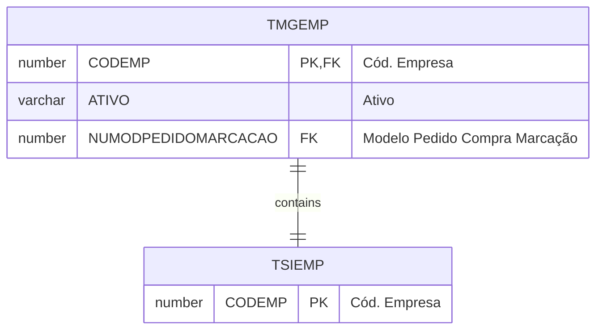

# TMGEMP

## Detalhamento do Objeto

Preferências por empresa

| Evento | Valor |
|--|--|
| **Nome tabela** | TMGEMP |
| **Descrição** | [MG] Preferencias por Empresa |
| **Nome instância** | MgEmpresa |
| **Descrição instância** | Preferencias por Empresa |
| **Lançador** |
| Descrição do Controle | [MG] Preferencias por Empresa |
| Identificador | br.com.sankhya.pwn.margran.Empresa |
| Evento | ${dynaform:MgEmpresa} |
| contexto | pwnmargran |
| entityName | MgEmpresa |
| resourceID | br.com.pwn.margran.core.mgempresa |

### Objetos Relacionados

| Nome | Tipo do Objeto | Descrição |
|--|--|--|
| TSIEMP | Tabela | Empresa |

### Modelagem

### Histórico de Revisões

| Versão | Data | Autor | Observações |
|:--:|:--:|--|--|
| 1.2 | 03/01/2025 | Cassio Menezes | Nova estrutura |
| 1.0 | 05/12/2024 | Cassio Menezes | Criação do documento |
