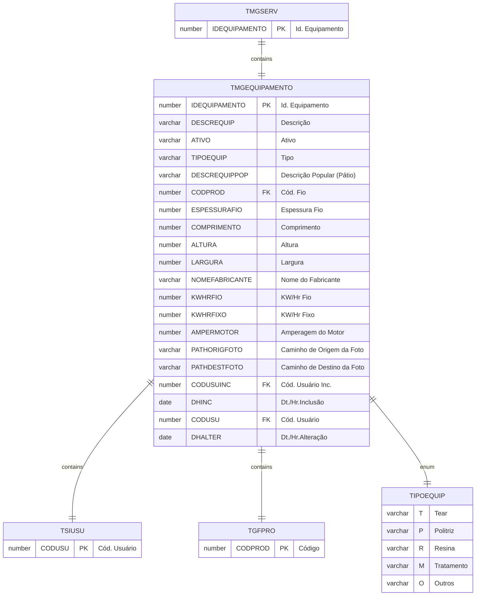

# TMGEQUIPAMENTO

## Detalhamento do Objeto

Tipos de Serviços a serem utilizados na transformação de blocos e chapas.

| Evento | Valor |
|--|--|
| **Nome tabela** | TMGEQUIPAMENTO |
| **Descrição** | [MG] Equipamento |
| **Nome instância** | MgEquipamento |
| **Descrição instância** | Equipamento |
| **Lançador** |
| Descrição do Controle | [MG] Equipamento |
| Identificador | br.com.sankhya.pwn.margran.Equipamento |
| Evento | ${dynaform:MgEquipamento} |
| contexto | pwnmargran |
| entityName | MgEquipamento |
| resourceID | br.com.pwn.margran.equipamento |

### Objetos Relacionados

| Nome | Tipo do Objeto | Descrição |
|--|--|--|
| TSIUSU | Tabela | Usuario |
| [TMGSERV](TMGSERV.md) | Tabela | [MG] Serviço |

### Modelagem

### Histórico de Revisões

| Versão | Data | Autor | Observações |
|:--:|:--:|--|--|
| 1.0 | 15/01/2025 | Cassio Menezes | Criação do documento |
