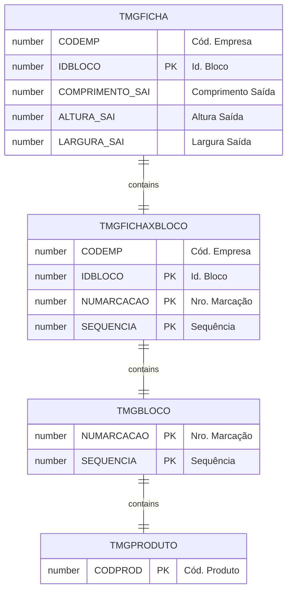

# TMGFICHA

## Detalhamento do Objeto

A Ficha de Bloco é um facilitador que visa agrupar todas as informações a respeito de compras, produção, vendas, previsão de produção e todo o processo da vida do Bloco. 

### Objetos Relacionados

| Nome | Tipo do Objeto | Descrição |
|--|--|--|
| [TMGFICHAXBLOCO](TMGFICHAXBLOCO.md) | Tabela | [MG] Ficha x Bloco |
| [TMGBLOCO](TMGBLOCO.md) | Tabela | [MG] Bloco |

### Modelagem

### Histórico de Revisões

| Versão | Data | Autor | Observações |
|:--:|:--:|--|--|
| 1.0 | 19/12/2025 | Cassio Menezes | Criação do documento |
