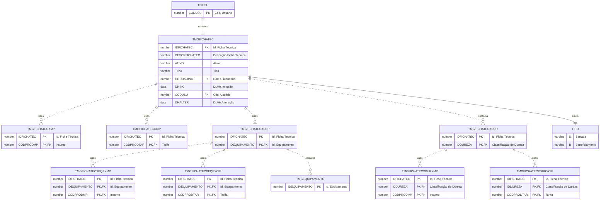

# TMGFICHATEC

A **Ficha Técnica** é uma das configurações mais importantes e essenciais no sistema. É um cadastro que conduzirá a produção. 

A **Ficha Técnica** é de dois tipos: "Serrada" e "Beneficiamento".

Filtra as Durezas permitidas para o processo e também os Equipamentos que podem ser utilizados.

## Detalhamento do Objeto

A *Ficha Técnica* .

| Evento | Valor |
|--|--|
| **Nome tabela** | TMGFICHATEC |
| **Descrição** | [MG] Ficha Técnica |
| **Nome instância** | MgFichaTecnica |
| **Descrição instância** | Ficha Técnica |
| **Lançador** |
| Descrição do Controle | [MG] Ficha Técnica |
| Identificador | br.com.sankhya.pwn.margran.FichaTecnica |
| Evento | ${dynaform:MgFichaTecnica} |
| contexto | pwnmargran |
| entityName | MgFichaTecnica |
| resourceID | br.com.pwn.margran.fichatecnica |

### Objetos Relacionados

| Nome | Tipo do Objeto | Descrição |
|--|--|--|
| TSIUSU | Tabela | Usuario |
| [TMGDUREZA](TMGDUREZA.md) | Tabela | [MG] Classificação de Dureza |
| [TMGEQUIPAMENTO](TMGEQUIPAMENTO.md) | Tabela | [MG] Equipamento |
| [TMGFICHATECXCIP](TMGFICHATECXCIP.md) | Tabela | [MG] Ficha Técnica x Tarifas CIP |
| [TMGFICHATECXDUR](TMGFICHATECXDUR.md) | Tabela | [MG] Ficha Técnica x Dureza |
| [TMGFICHATECXDURXCIP](TMGFICHATECXDURXCIP.md) | Tabela | [MG] Ficha Técnica x Dureza x Tarifa |
| [TMGFICHATECXDURXMP](TMGFICHATECXDURXMP.md) | Tabela | [MG] Ficha Técnica x Dureza x Insumo |
| [TMGFICHATECXEQP](TMGFICHATECXEQP.md) | Tabela | [MG] Ficha Técnica x Equipamento |

### Modelagem

### Histórico de Revisões

| Versão | Data | Autor | Observações |
|:--:|:--:|--|--|
| 2.0 | 23/01/2025 | Cassio Menezes | Atualização da estrutura para insumos e tarifas |
| 1.0 | 09/01/2025 | Cassio Menezes | Criação do documento |
