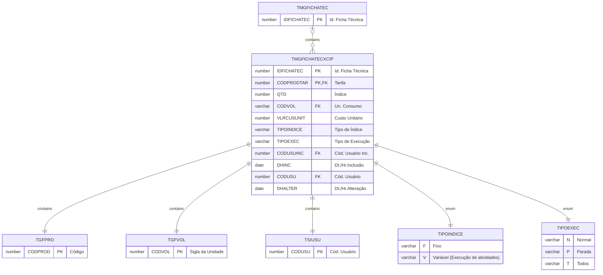

# TMGFICHATECXCIP

Tarifas a serem utilizadas para cálculo de custo.

## Detalhamento do Objeto

| Evento | Valor |
|--|--|
| **Nome tabela** | TMGFICHATECXCIP |
| **Descrição** | [MG] Ficha Técnica x Tarifas CIP |
| **Nome instância** | MgFichaTecnicaXCIP |
| **Descrição instância** | Tarifas CIP |

### Objetos Relacionados

| Nome | Tipo do Objeto | Descrição |
|--|--|--|
| TGFPRO | Tabela | TarifasCIP |
| TGFVOL | Tabela | Volume |
| TSIUSU | Tabela | Usuario |
| [TMGDUREZA](TMGDUREZA.md) | Tabela | [MG] Classificação de Dureza |

### Modelagem

### Histórico de Revisões

| Versão | Data | Autor | Observações |
|:--:|:--:|--|--|
| 1.0 | 21/01/2025 | Cassio Menezes | Criação do documento |
