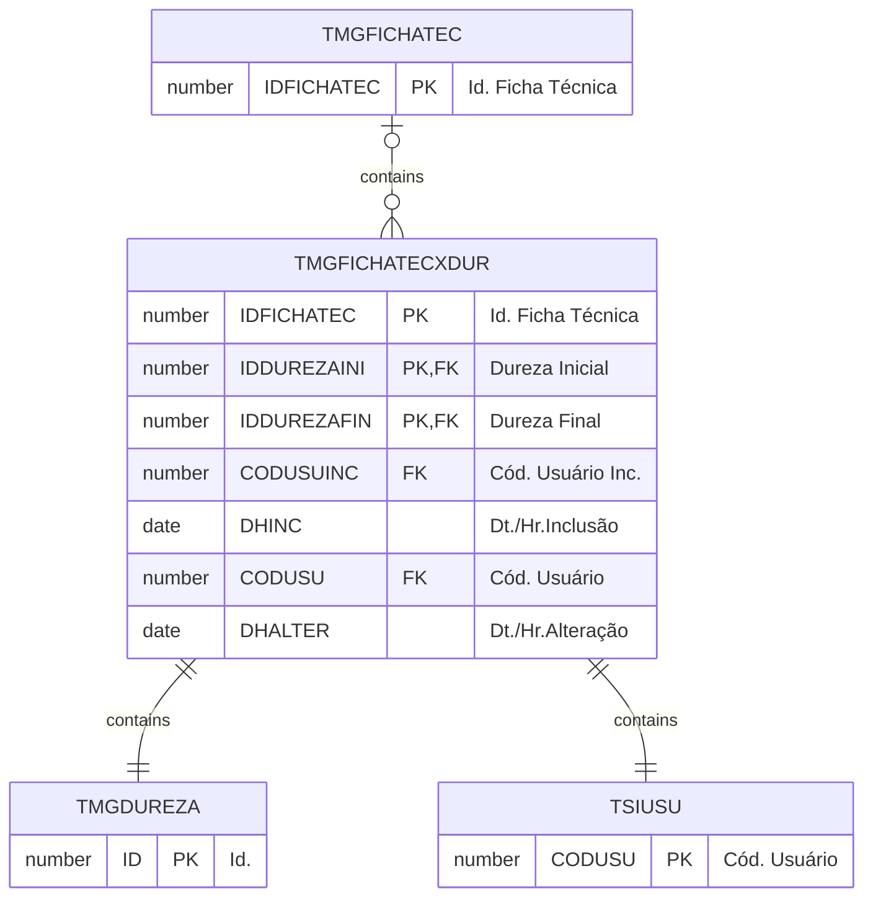

# TMGFICHATECXDUR

Filtro a ser aplicado no processo de Serrada de Blocos para validar a inclusão da matéria prima, no caso Blocos.

## Detalhamento do Objeto

| Evento | Valor |
|--|--|
| **Nome tabela** | TMGFICHATECXDUR |
| **Descrição** | [MG] Dureza Permitida |
| **Nome instância** | MgFichaTecnicaXDur |
| **Descrição instância** | Dureza Permitida |

### Objetos Relacionados

| Nome | Tipo do Objeto | Descrição |
|--|--|--|
| TSIUSU | Tabela | Usuario |
| [TMGDUREZA](TMGDUREZA.md) | Tabela | [MG] Classificação de Dureza |
| [TMGFICHATEC](TMGFICHATEC.md) | Tabela | [MG] Ficha Técnica |
| [TMGFICHATECXDURXMP](TMGFICHATECXDURXMP.md) | Tabela | [MG] Ficha Técnica x Dureza x Insumo |

### Modelagem

### Histórico de Revisões

| Versão | Data | Autor | Observações |
|:--:|:--:|--|--|
| 1.0 | 21/01/2025 | Cassio Menezes | Criação do documento |
