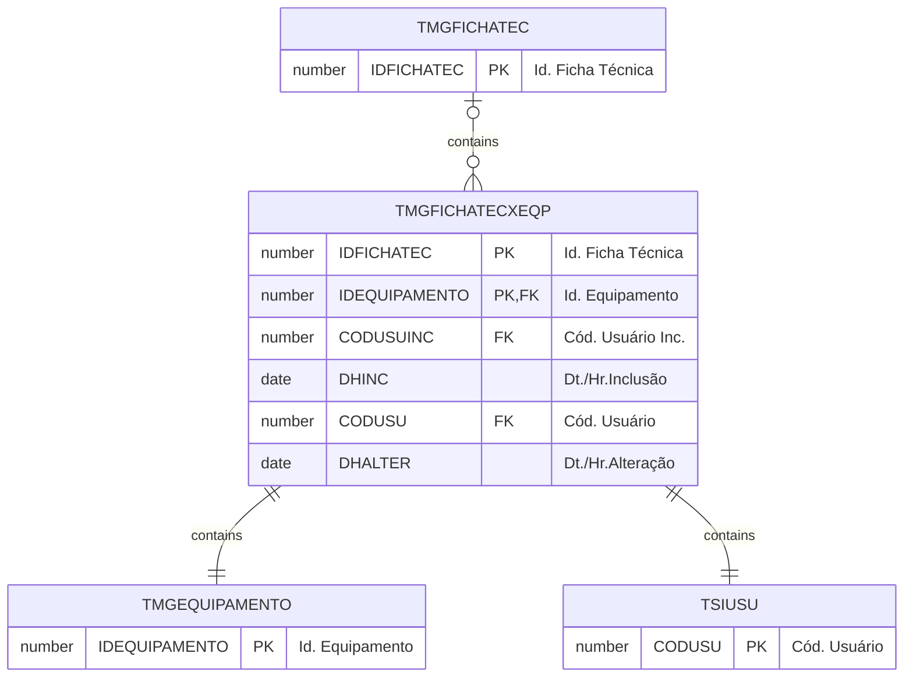

# TMGFICHATECXEQP

Filtro a ser aplicado no processo de Serrada de Blocos para validar a inclusão da matéria prima, no caso Blocos.

## Detalhamento do Objeto

| Evento | Valor |
|--|--|
| **Nome tabela** | TMGFICHATECXEQP |
| **Descrição** | [MG] Ficha Técnica x Equipamento |
| **Nome instância** | MgFichaTecnicaXEqp |
| **Descrição instância** | Equipamento |

### Objetos Relacionados

| Nome | Tipo do Objeto | Descrição |
|--|--|--|
| TSIUSU | Tabela | Usuario |
| [TMGEQUIPAMENTO](TMGEQUIPAMENTO.md) | Tabela | [MG] Equipamento |
| [TMGFICHATEC](TMGFICHATEC.md) | Tabela | [MG] Ficha Técnica |
| [TMGFICHATECXEQPXMP](TMGFICHATECXEQPXMP.md) | Tabela | [MG] Ficha Técnica x Equipamento x Insumo |

### Modelagem

### Histórico de Revisões

| Versão | Data | Autor | Observações |
|:--:|:--:|--|--|
| 1.0 | 26/01/2025 | Cassio Menezes | Criação do documento |
