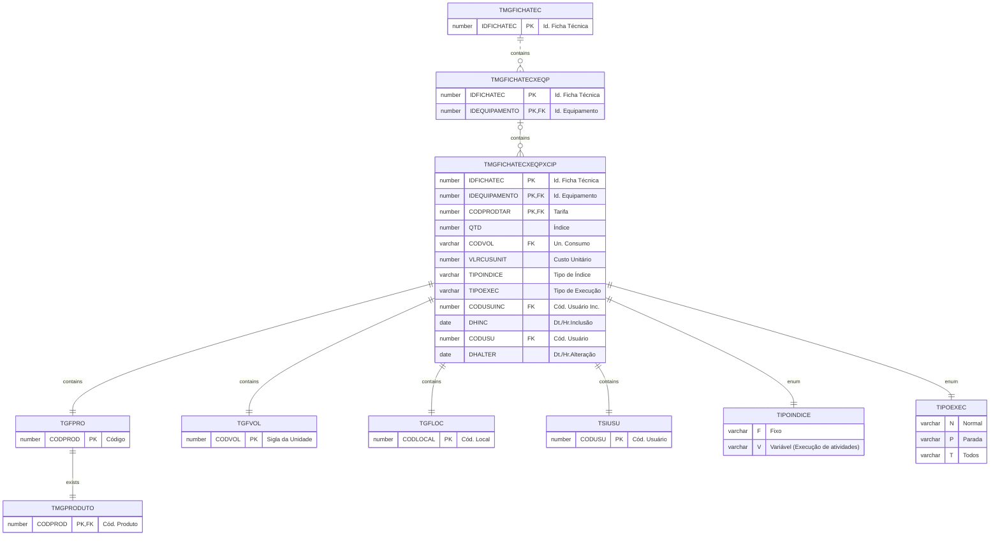

# TMGFICHATECXEQPXCIP

Filtro a ser aplicado no processo de Serrada de Blocos para validar a inclusão da matéria prima, no caso Blocos.

## Detalhamento do Objeto

| Evento | Valor |
|--|--|
| **Nome tabela** | TMGFICHATECXEQPXCIP |
| **Descrição** | [MG] Ficha Técnica x Equipamento x Tarifa |
| **Nome instância** | MgFichaTecnicaXEqpXCIP |
| **Descrição instância** | Tarifas CIP |

### Objetos Relacionados

| Nome | Tipo do Objeto | Descrição |
|--|--|--|
| TGFPRO | Tabela | TarifasCIP |
| TGFVOL | Tabela | Volume |
| TGFLOC | Tabela | LocalFinanceiro |
| TSIUSU | Tabela | Usuario |
| [TMGFICHATEC](TMGFICHATEC.md) | Tabela | [MG] Ficha Técnica |
| [TMGFICHATECXEQP](TMGFICHATECXEQP.md) | Tabela | [MG] Ficha Técnica x Equipamento |

### Modelagem

### Histórico de Revisões

| Versão | Data | Autor | Observações |
|:--:|:--:|--|--|
| 1.0 | 28/01/2025 | Cassio Menezes | Criação do documento |
