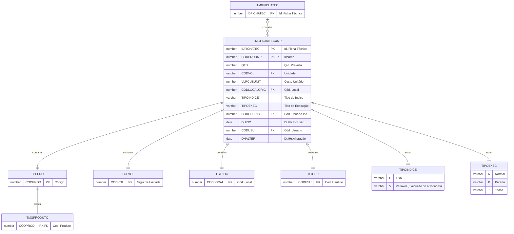

# TMGFICHATECXMP

## Detalhamento do Objeto

| Evento | Valor |
|--|--|
| **Nome tabela** | TMGFICHATECXMP |
| **Descrição** | [MG] Ficha Técnica x Insumos |
| **Nome instância** | MgFichaTecnicaXMP |
| **Descrição instância** | Insumos |

### Objetos Relacionados

| Nome | Tipo do Objeto | Descrição |
|--|--|--|
| TGFPRO | Tabela | ProdutoMateriaPrima |
| TGFVOL | Tabela | Volume |
| TGFLOC | Tabela | 
| TSIUSU | Tabela | Usuario |
| [TMGFICHATEC](TMGFICHATEC.md) | Tabela | [MG] Ficha Técnica |
| [TMGPRODUTO](TMGPRODUTO.md) | Tabela | [MG] Produto |

### Modelagem

### Histórico de Revisões

| Versão | Data | Autor | Observações |
|:--:|:--:|--|--|
| 1.0 | 21/01/2025 | Cassio Menezes | Criação do documento |
