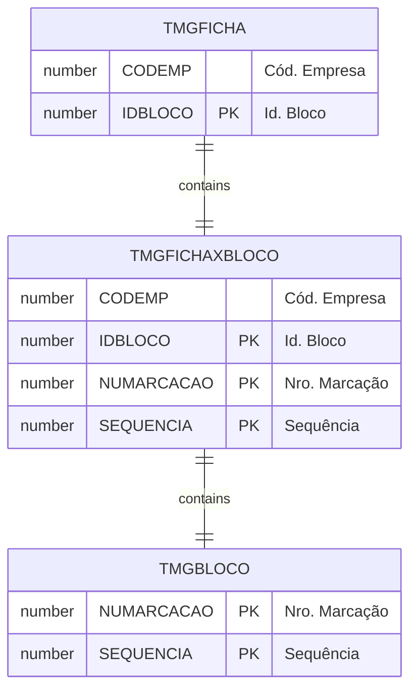

# TMGFICHAXBLOCO

## Detalhamento do Objeto

A Ficha de Bloco é um facilitador que visa agrupar todas as informações a respeito de compras, produção, vendas, previsão de produção e todo o processo da vida do Bloco. 

| Evento | Valor |
|--|--|
| **Nome tabela** | TMGFICHAXBLOCO |
| **Descrição** | [MG] Ficha x Bloco |
| **Nome instância** | MgFichaXBloco |
| **Descrição instância** | Ficha x Bloco |

### Objetos Relacionados

| Nome | Tipo do Objeto | Descrição |
|--|--|--|
| [TMGFICHA](TMGFICHA.md) | Tabela | [MG] Ficha |
| [TMGBLOCO](TMGBLOCO.md) | Tabela | [MG] Bloco |

### Modelagem

### Histórico de Revisões

| Versão | Data | Autor | Observações |
|:--:|:--:|--|--|
| 1.2 | 03/01/2025 | Cassio Menezes | Nova estrutura |
| 1.0 | 19/12/2024 | Cassio Menezes | Criação do documento |
