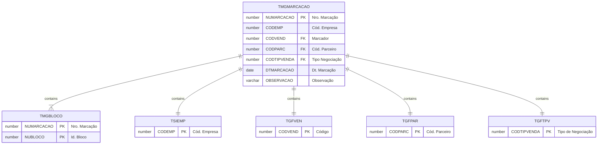

# TMGMARCACAO

## Detalhamento do Objeto

O Marcador compra Blocos diretamente na pedreira, anotando as medidas (bruta e líquida) do material, valor unitário de compra, valor do frete, classificação e observações. Cada bloco tem um número de pedreira próprio.

Esta tabela registra as negociações de compra de blocos de uma determinada pedreira e é a base para a geração de pedidos de compra de marcação.

### Objetos Relacionados

| Nome | Tipo do Objeto | Descrição |
|--|--|--|
| TSIEMP | Tabela | Empresa |
| TGFVEN | | |
| TGFPAR | | |
| TGFTPV | | |
| [TMGBLOCO](TMGBLOCO.md) | Tabela | [MG] Bloco |

### Modelagem

### Histórico de Revisões

| Versão | Data | Autor | Observações |
|:--:|:--:|--|--|
| 1.0 | 04/12/2025 | Cassio Menezes | Criação do documento |
