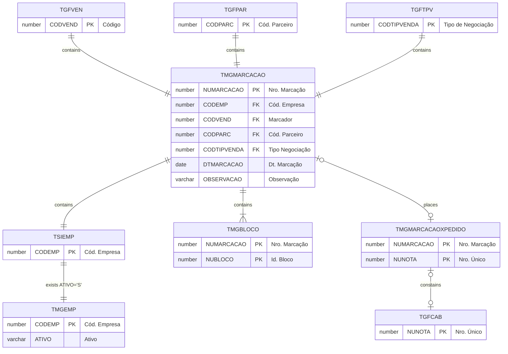

# TMGMARCACAO

## Detalhamento do Objeto

O Marcador compra Blocos diretamente na pedreira, anotando as medidas (bruta e líquida) do material, valor unitário de compra, valor do frete, classificação e observações. Cada bloco tem um número de pedreira próprio.

Esta tabela registra as negociações de compra de blocos de uma determinada pedreira e é a base para a geração de pedidos de compra de marcação.

| Evento | Valor |
|--|--|
| **Nome tabela** | TMGMARCACAO |
| **Descrição** | [MG] Marcacao |
| **Nome instância** | MgMarcacao |
| **Descrição instância** | Ficha Técnica |
| **Lançador** |
| Descrição do Controle | [MG] Marcacao |
| Identificador | br.com.sankhya.pwn.margran.Marcacao |
| Evento | /pwnmargran/MgMarcacao.xhtml5?mgeSession=${mge.session.id}&resourceID=${resourceID} |
| contexto | pwnmargran |
| entityName | MgMarcacao |
| resourceID | br.com.pwn.margran.marcacao |

### Objetos Relacionados

| Nome | Tipo do Objeto | Descrição |
|--|--|--|
| TSIEMP | Tabela | Empresa |
| TGFVEN | Tabela | Vendedor |
| TGFPAR | Tabela | Parceiro |
| TGFTPV | Tabela | TipoNegociacao |
| TGFCAB | Tabela | CabecalhoNota |
| [TMGBLOCO](TMGBLOCO.md) | Tabela | [MG] Bloco |
| [TMGEMP](TMGEMP.md) | Tabela | [MG] Preferencias por Empresa |
| [TMGMARCACAOXPEDIDO](TMGMARCACAOXPEDIDO.md) | Tabela | [MG] Marcacao x Pedido |

### Modelagem

### Histórico de Revisões

| Versão | Data | Autor | Observações |
|:--:|:--:|--|--|
| 1.2 | 03/01/2025 | Cassio Menezes | Nova estrutura |
| 1.0 | 04/12/2024 | Cassio Menezes | Criação do documento |
