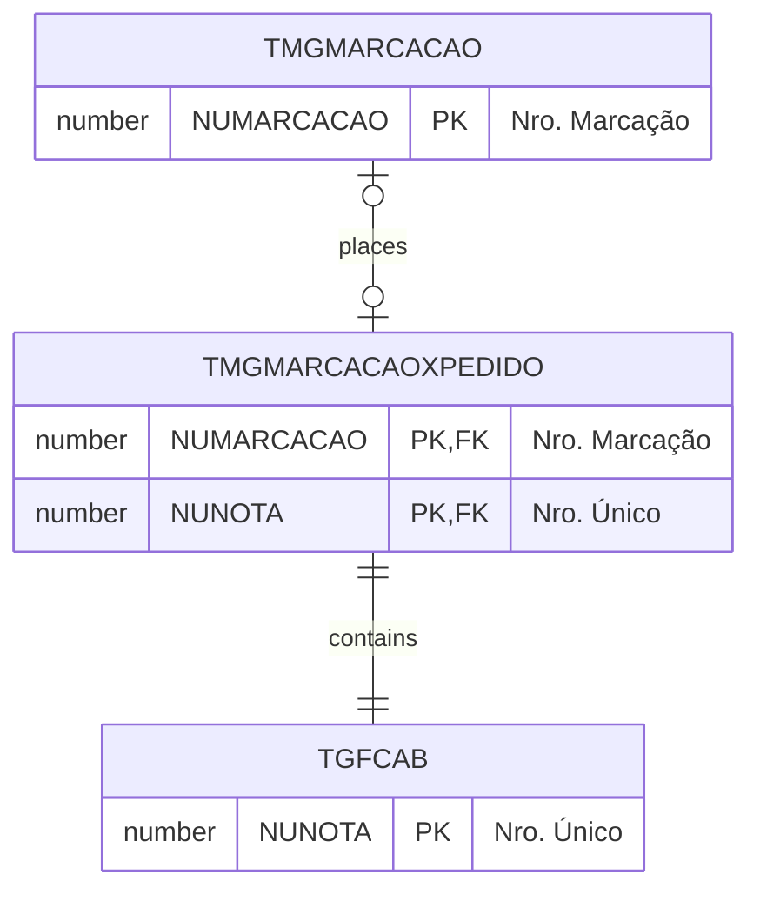

# TMGMARCACAOXPEDIDO

## Detalhamento do Objeto

| Evento | Valor |
|--|--|
| **Nome tabela** | TMGMARCACAOXPEDIDO |
| **Descrição** | [MG] Marcacao x Pedido |
| **Nome instância** | MgMarcacaoXPedido |
| **Descrição instância** | Pedido de Compra Marcação |

### Modelagem

### Histórico de Revisões

| Versão | Data | Autor | Observações |
|:--:|:--:|--|--|
| 1.2 | 03/01/2025 | Cassio Menezes | Nova estrutura |
| 1.0 | 23/12/2024 | Cassio Menezes | Criação do documento |
