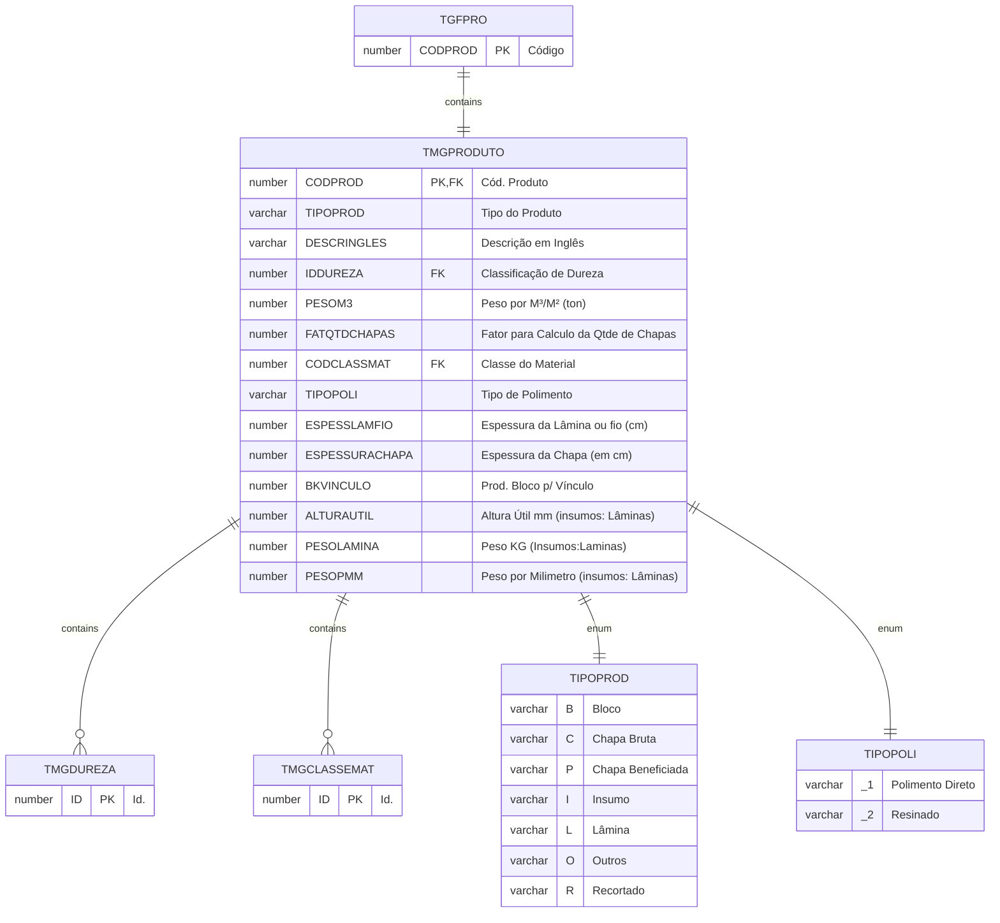
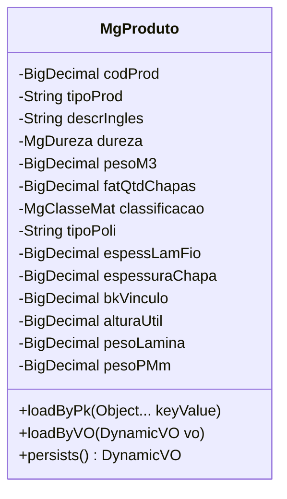

# TMGPRODUTO

## Detalhamento do Objeto

Campos complementares do cadastro de produtos, necessários aos procedimentos do módulo Mármore e Granito.

### Objetos Relacionados

| Nome | Tipo do Objeto | Descrição |
|--|--|--|
| TGFPRO | Tabela | Produto |
| [TMGDUREZA](TMGDUREZA.md) | Tabela | [MG] Dureza |
| [TMGCLASSEMAT](TMGCLASSEMAT.md) | Tabela | [MG] Classe de Material |

### Modelagem





```java
$sql.select("P.DESCRPROD","TGFPRO P","P.CODPROD = "+$col_CODPROD);
	if($sql.next()){
		return $sql.getString(1);
	}
	
return null;


return com.sankhya.util.BigDecimalUtil.getValueOrZero((java.math.BigDecimal) $col_KMCHEGADA).doubleValue() - com.sankhya.util.BigDecimalUtil.getValueOrZero((java.math.BigDecimal) $col_KMSAIDA).doubleValue()

return com.sankhya.util.BigDecimalUtil.getValueOrZero($col_COMPRIMENTO).multiply(com.sankhya.util.BigDecimalUtil.getValueOrZero($col_ALTURA)).multiply(com.sankhya.util.BigDecimalUtil.getValueOrZero($col_LARGURA))

return com.sankhya.util.BigDecimalUtil.getValueOrZero($col_COMPRIMENTO_LIQ).multiply(com.sankhya.util.BigDecimalUtil.getValueOrZero($col_ALTURA_LIQ)).multiply(com.sankhya.util.BigDecimalUtil.getValueOrZero($col_LARGURA_LIQ))

```

### Histórico de Revisões

| Versão | Data | Autor | Observações |
|:--:|:--:|--|--|
| 1.1 | 19/11/2025 | Cassio Menezes | Ajuste nomenclatura |
| 1.0 | 12/11/2025 | Cassio Menezes | Criação do documento |
