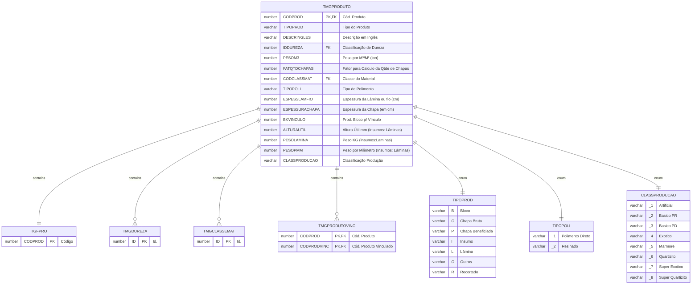

# TMGPRODUTO

## Detalhamento do Objeto

Campos complementares do cadastro de produtos, necessários aos procedimentos do módulo Mármore e Granito.

| Evento | Valor |
|--|--|
| **Nome tabela** | TMGPRODUTO |
| **Descrição** | [MG] Produto |
| **Nome instância** | MgProduto |
| **Descrição instância** | Complemento do Produto |
| **Lançador** |
| Descrição do Controle | [MG] Produto |
| Identificador | br.com.sankhya.pwn.margran.Produto |
| Evento | ${dynaform:MgProduto} |
| contexto | pwnmargran |
| entityName | MgProduto |
| resourceID | br.com.pwn.margran.core.mgproduto |

### Objetos Relacionados

| Nome | Tipo do Objeto | Descrição |
|--|--|--|
| TGFPRO | Tabela | Produto |
| [TMGDUREZA](TMGDUREZA.md) | Tabela | [MG] Dureza |
| [TMGCLASSEMAT](TMGCLASSEMAT.md) | Tabela | [MG] Classe de Material |
| [TMGPRODUTOVINC](TMGPRODUTOVINC.md) | Tabela | [MG] Produto Vinculado |

### Modelagem


### Campos Calculados

#### DESCRPROD

```java
$sql.select("P.DESCRPROD","TGFPRO P","P.CODPROD = "+$col_CODPROD);
	if($sql.next()){
		return $sql.getString(1);
	}
	
return null;
```

### Histórico de Revisões

| Versão | Data | Autor | Observações |
|:--:|:--:|--|--|
| 1.3 | 03/01/2025 | Cassio Menezes | Adicionar campo |
| 1.2 | 03/01/2025 | Cassio Menezes | Nova estrutura |
| 1.1 | 19/11/2024 | Cassio Menezes | Ajuste nomenclatura |
| 1.0 | 12/11/2024 | Cassio Menezes | Criação do documento |
