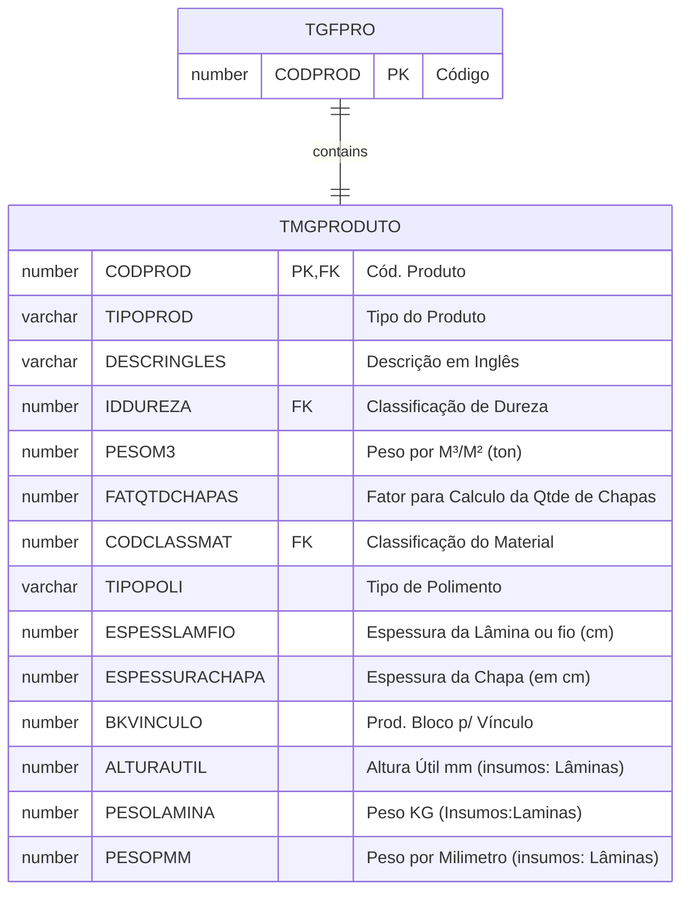
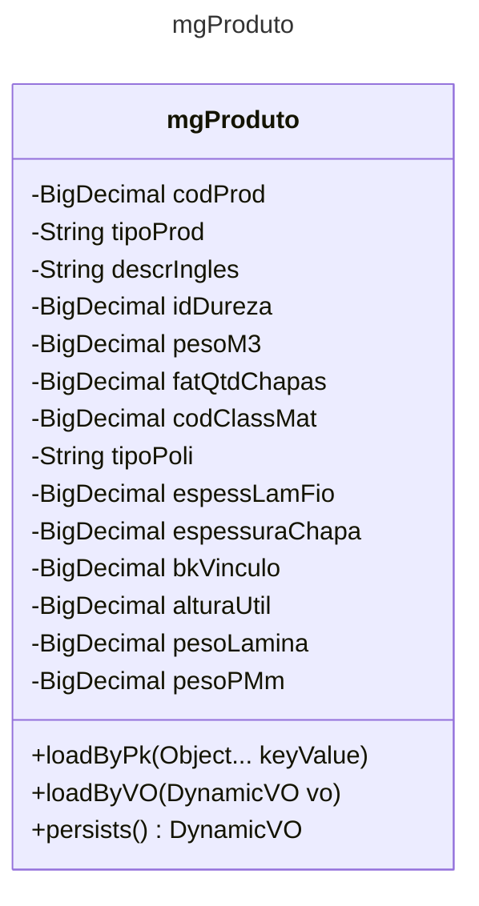

# TMGPRODUTO

## Detalhamento do Objeto

### Objetos Relacionados

| Nome | Tipo do Objeto | Descrição |
|--|--|--|
| TGFPRO | Tabela | Produto |

### Modelagem

### Histórico de Revisões

| Versão | Data | Autor | Observações |
|:--:|:--:|--|--|
| 1.0 | 12/11/2025 | Cassio Menezes | Criação do documento |