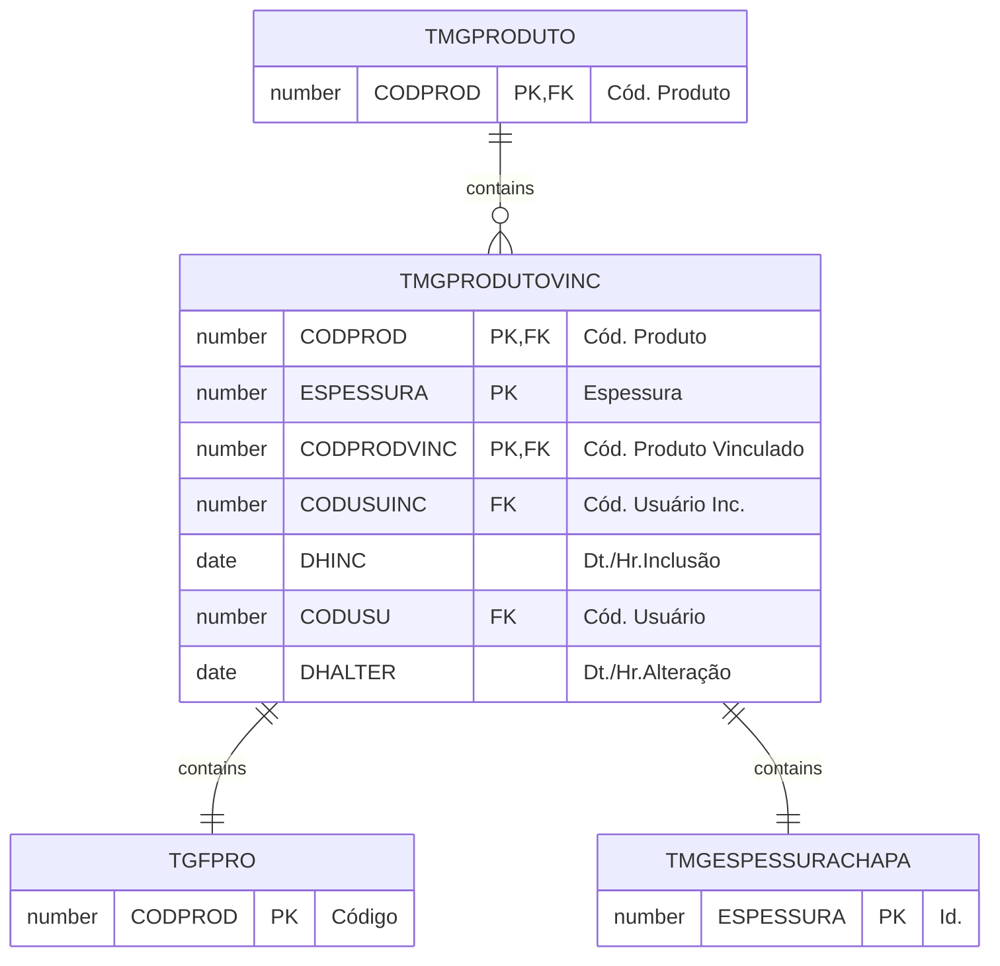

# TMGPRODUTOVINC

## Detalhamento do Objeto

Campos complementares do cadastro de produtos, necessários aos procedimentos do módulo Mármore e Granito.

| Evento | Valor |
|--|--|
| **Nome tabela** | TMGPRODUTOVINC |
| **Descrição** | [MG] Produto Vinculado |
| **Nome instância** | MgProdutoVinc |
| **Descrição instância** | Produtos vinculados |

### Objetos Relacionados

| Nome | Tipo do Objeto | Descrição |
|--|--|--|
| TGFPRO | Tabela | Produto |
| [TMGPRODUTO](TMGPRODUTO.md) | Tabela | [MG] Produto |
| [TMGESPESSURACHAPA](TMGESPESSURACHAPA.md) | Tabela | [MG] Espessura de Chapa |

### Modelagem

### Campos Calculados

### Histórico de Revisões

| Versão | Data | Autor | Observações |
|:--:|:--:|--|--|
| 1.0 | 30/01/2025 | Cassio Menezes | Criação do documento |
