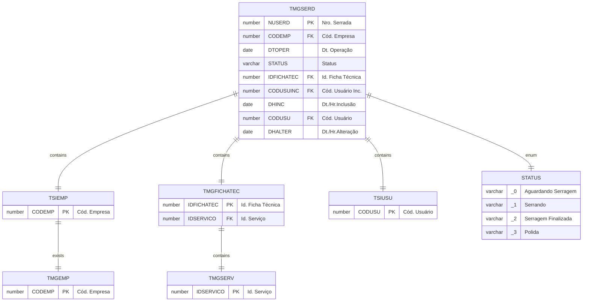

# TMGSERD

## Detalhamento do Objeto

Serrada refere-se ao ato de serrar, ou seja, o processo de corte do bloco em chapas utilizando serras específicas, como teares multilâminas ou multifios. É o termo que descreve a ação em si e o resultado desse processo: as chapas serradas.

O processo de serrada é crucial na produção de chapas de rochas ornamentais. A qualidade da serrada influencia diretamente na qualidade final do produto, como o acabamento e a espessura das chapas. Diversos parâmetros influenciam na serrada, como o tipo de serra, a velocidade de corte, o tipo de abrasivo utilizado e as características da rocha.

| Evento | Valor |
|--|--|
| **Nome tabela** | TMGSERD |
| **Descrição** | [MG] Serrada de Bloco |
| **Nome instância** | MgSerrada |
| **Descrição instância** | Serrada de Bloco |
| **Lançador** |
| Descrição do Controle | [MG] Serrada de Bloco |
| Identificador | br.com.sankhya.pwn.margran.Serrada |
| Evento | ${dynaform:MgSerrada} |
| contexto | pwnmargran |
| entityName | MgSerrada |
| resourceID | br.com.pwn.margran.serrada |

### Objetos Relacionados

| Nome | Tipo do Objeto | Descrição |
|--|--|--|
| TSIEMP | Tabela | Empresa |
| TSIUSU | Tabela | Usuario |
| [TMGEMP](TMGEMP.md) | Tabela | [MG] Preferencias por Empresa |
| [TMGFICHATEC](TMGFICHATEC.md) | Tabela | [MG] Ficha Técnica |

### Modelagem

### Histórico de Revisões

| Versão | Data | Autor | Observações |
|:--:|:--:|--|--|
| 1.0 | 08/01/2025 | Cassio Menezes | Criação do documento |
