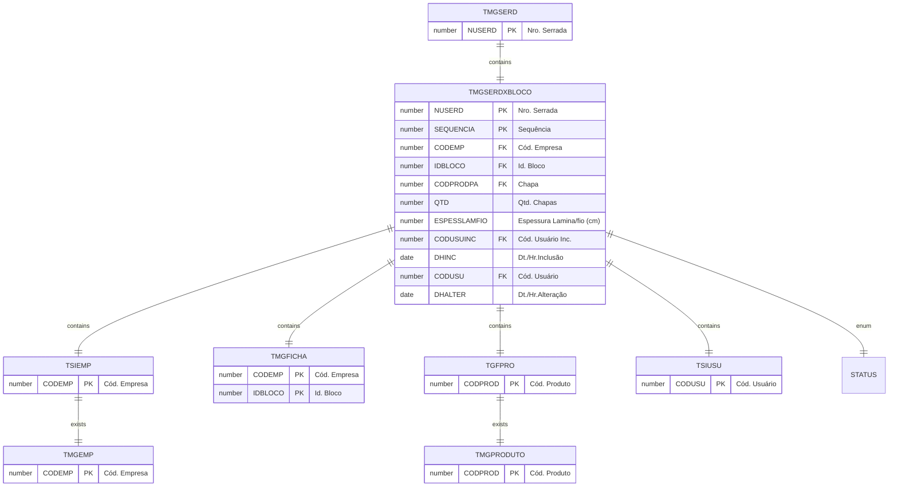

# TMGSERDXBLOCO

## Detalhamento do Objeto

Serrada refere-se ao ato de serrar, ou seja, o processo de corte do bloco em chapas utilizando serras específicas, como teares multilâminas ou multifios. É o termo que descreve a ação em si e o resultado desse processo: as chapas serradas.

O processo de serrada é crucial na produção de chapas de rochas ornamentais. A qualidade da serrada influencia diretamente na qualidade final do produto, como o acabamento e a espessura das chapas. Diversos parâmetros influenciam na serrada, como o tipo de serra, a velocidade de corte, o tipo de abrasivo utilizado e as características da rocha.

| Evento | Valor |
|--|--|
| **Nome tabela** | TMGSERDXBLOCO |
| **Descrição** | [MG] Serrada de Bloco X Bloco |
| **Nome instância** | MgSerradaXBloco |
| **Descrição instância** | Blocos |

### Objetos Relacionados

| Nome | Tipo do Objeto | Descrição |
|--|--|--|
| TGFPRO | Tabela | Produto |
| TSIEMP | Tabela | Empresa |
| TSIUSU | Tabela | Usuario |
| [TMGEMP](TMGEMP.md) | Tabela | [MG] Preferencias por Empresa |
| [TMGFICHATEC](TMGFICHATEC.md) | Tabela | [MG] Ficha Técnica |
| [TMGPRODUTO](TMGPRODUTO.md) | Tabela | [MG] Produto |

### Modelagem

### Histórico de Revisões

| Versão | Data | Autor | Observações |
|:--:|:--:|--|--|
| 1.0 | 22/01/2025 | Cassio Menezes | Criação do documento |
