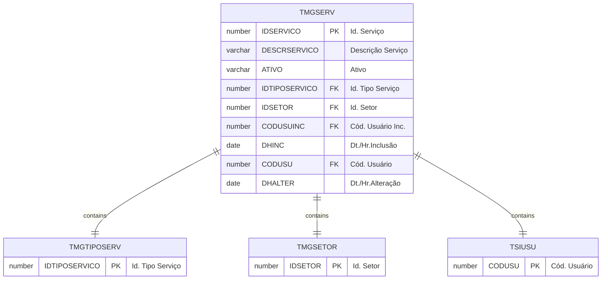

# TMGSERV

## Detalhamento do Objeto

Serviços a serem utilizados na transformação de blocos e chapas.

| Evento | Valor |
|--|--|
| **Nome tabela** | TMGSERV |
| **Descrição** | [MG] Serviço |
| **Nome instância** | MgServico |
| **Descrição instância** | Serviço |
| **Lançador** |
| Descrição do Controle | [MG] Serviço |
| Identificador | br.com.sankhya.pwn.margran.Servico |
| Evento | ${dynaform:MgServico} |
| contexto | pwnmargran |
| entityName | MgServico |
| resourceID | br.com.pwn.margran.servico |

### Objetos Relacionados

| Nome | Tipo do Objeto | Descrição |
|--|--|--|
| TSIUSU | Tabela | Usuario |
| [TMGTIPOSERV](TMGTIPOSERV.md) | Tabela | [MG] Tipo de Serviço |
| [TMGSETOR](TMGSETOR.md) | Tabela | [MG] Setor |
| [TMGEQUIPAMENTO](TMGEQUIPAMENTO.md) | Tabela | [MG] Equipamento |

### Modelagem

### Histórico de Revisões

| Versão | Data | Autor | Observações |
|:--:|:--:|--|--|
| 1.0 | 09/01/2025 | Cassio Menezes | Criação do documento |
