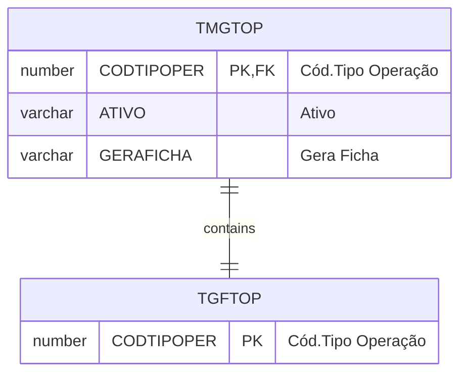

# TMGTOP

**Nome tabela**: TMGTOP  
**Descrição**: [MG] Tipos de Operacao - TOP  
**Nome instância**: MgTipoOperacao

## Detalhamento do Objeto

Preferências por TOP

| Evento | Valor |
|--|--|
| **Nome tabela** | TMGTOP |
| **Descrição** | [MG] Tipos de Operacao - TOP |
| **Nome instância** | MgTipoOperacao |
| **Descrição instância** | Complemento do Produto |
| **Lançador** |
| Descrição do Controle | [MG] Tipos de Operacao - TOP |
| Identificador | br.com.sankhya.pwn.margran.TiposDeOperacao |
| Evento | ${dynaform:MgTipoOperacao} |
| contexto | pwnmargran |
| entityName | MgTipoOperacao |
| resourceID | br.com.pwn.margran.core.mgtipooperacao |

### Objetos Relacionados

| Nome | Tipo do Objeto | Descrição |
|--|--|--|
| TGFTOP | Tabela | TipoOperacao |

### Modelagem

### Histórico de Revisões

| Versão | Data | Autor | Observações |
|:--:|:--:|--|--|
| 1.2 | 03/01/2025 | Cassio Menezes | Nova estrutura |
| 1.0 | 03/01/2024 | Cassio Menezes | Criação do documento |
