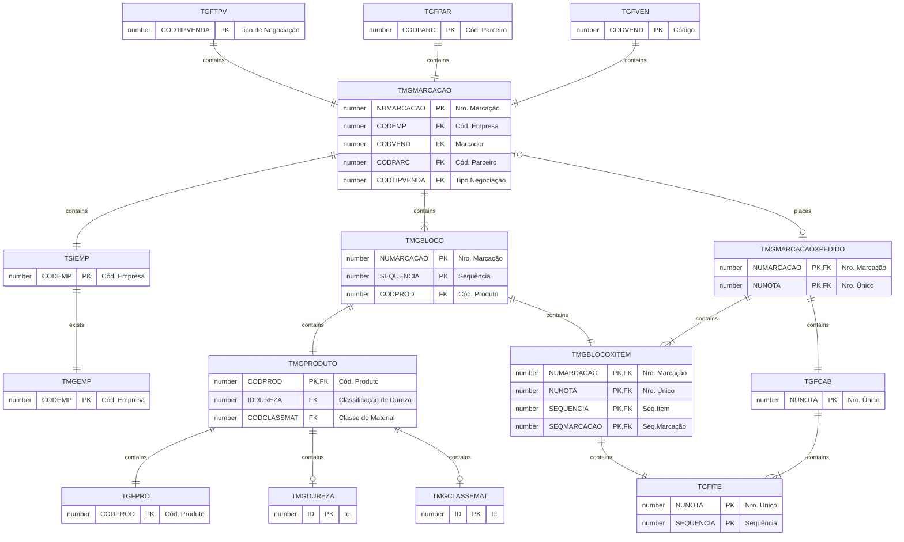
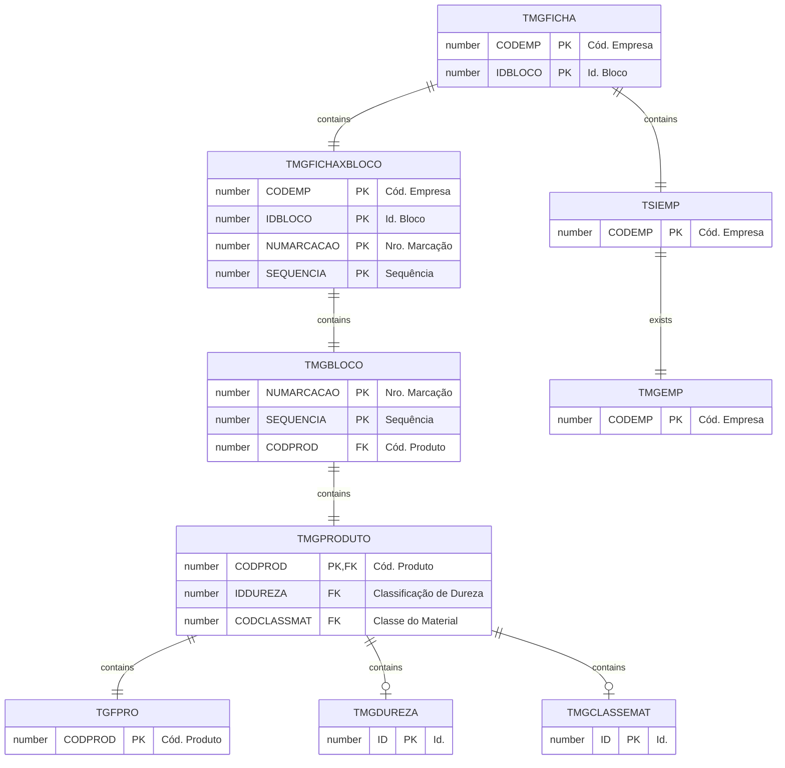
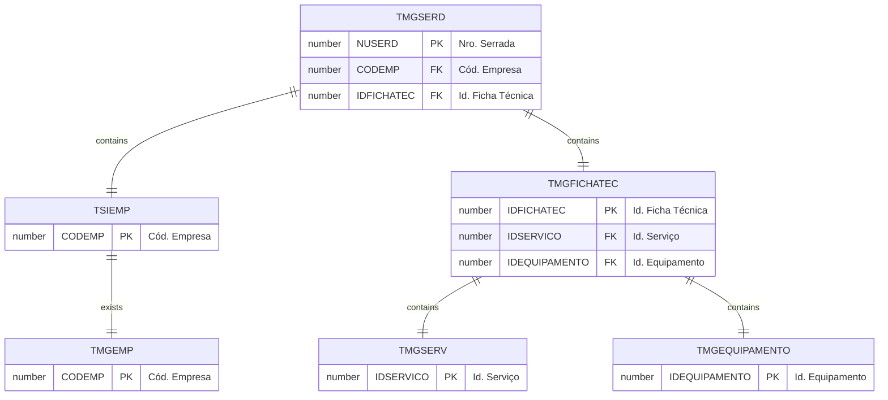

# Database Documentation

## Tables

| Tables |
|--|
| [TMGBLOCO](TMGBLOCO.md) |
| [TMGBLOCOXITEM](TMGBLOCOXITEM.md) |
| [TMGCLASSEMAT](TMGCLASSEMAT.md) |
| [TMGDUREZA](TMGDUREZA.md) |
| [TMGEMP](TMGEMP.md) |
| [TMGEQUIPAMENTO](TMGEQUIPAMENTO.md) |
| [TMGFICHA](TMGFICHA.md) |
| [TMGFICHATEC](TMGFICHATEC.md) |
| [TMGFICHAXBLOCO](TMGFICHAXBLOCO.md) |
| [TMGMARCACAO](TMGMARCACAO.md) |
| [TMGMARCACAOXPEDIDO](TMGMARCACAOXPEDIDO.md) |
| [TMGPRODUTO](TMGPRODUTO.md) |
| [TMGSERD](TMGSERD.md) |
| [TMGSERV](TMGSERV.md) |
| [TMGSETOR](TMGSETOR.md) |
| [TMGTIPOSERV](TMGTIPOSERV.md) |
| [TMGTOP](TMGTOP.md) |

### Modelagem

#### Marcação

#### Ficha do Bloco

#### Serrada

