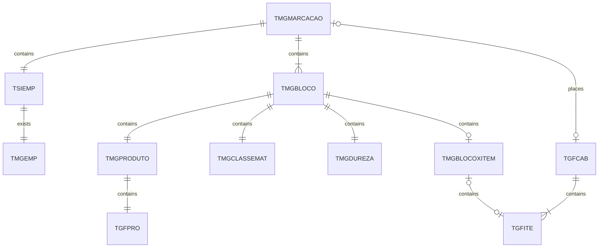
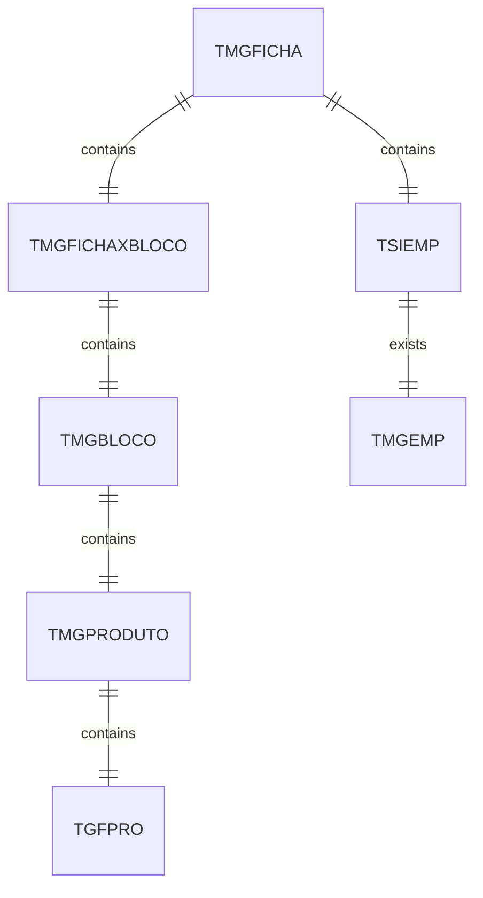

# Database Documentation

## Tables

|  |
|--|
| [TMGBLOCO](TMGBLOCO.md) |
| [TMGCLASSEMAT](TMGCLASSEMAT.md) |
| [TMGDUREZA](TMGDUREZA.md) |
| [TMGEMP](TMGEMP.md) |
| [TMGFICHA](TMGFICHA.md) |
| [TMGFICHAXBLOCO](TMGFICHAXBLOCO.md) |
| [TMGMARCACAO](TMGMARCACAO.md) |
| [TMGPRODUTO](TMGPRODUTO.md) |

### Modelagem

